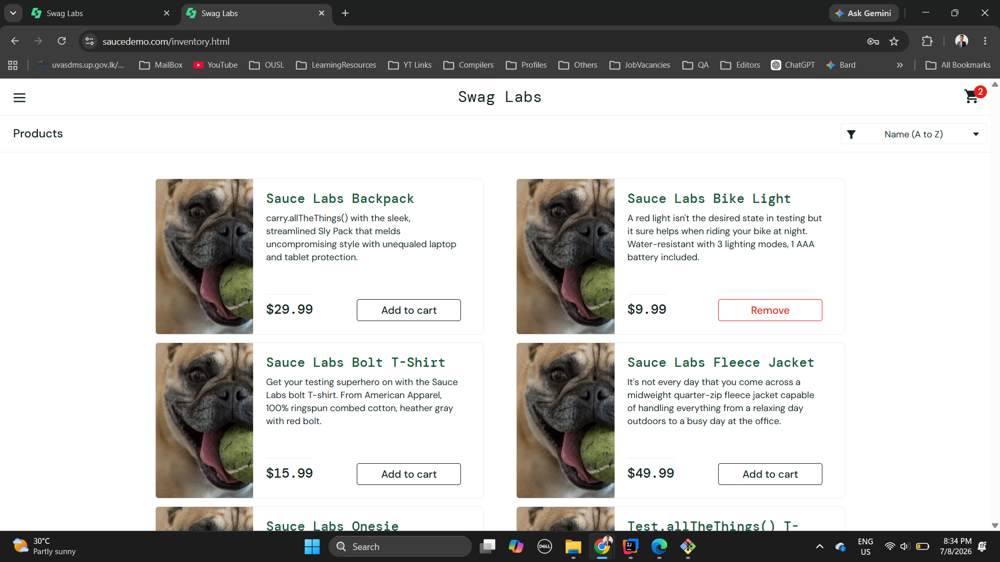
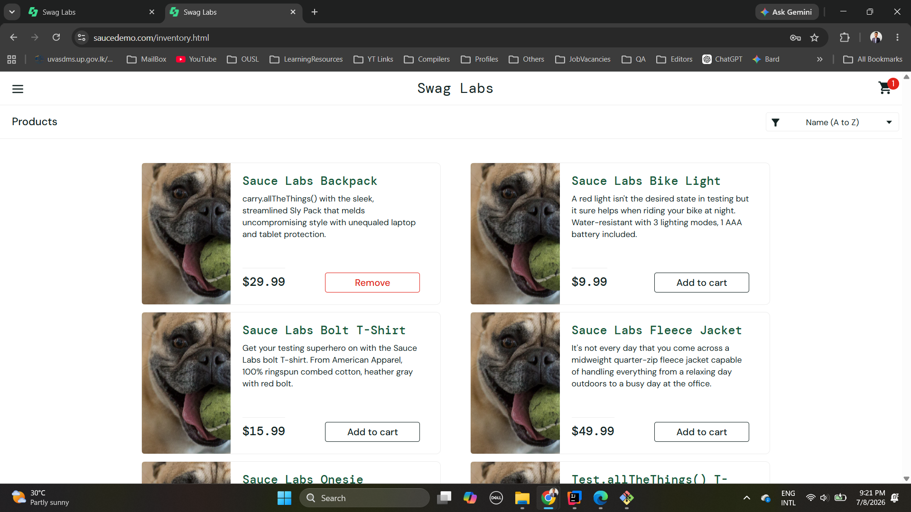
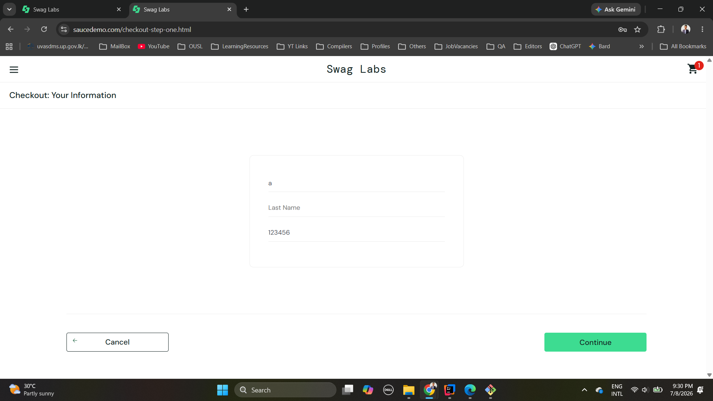
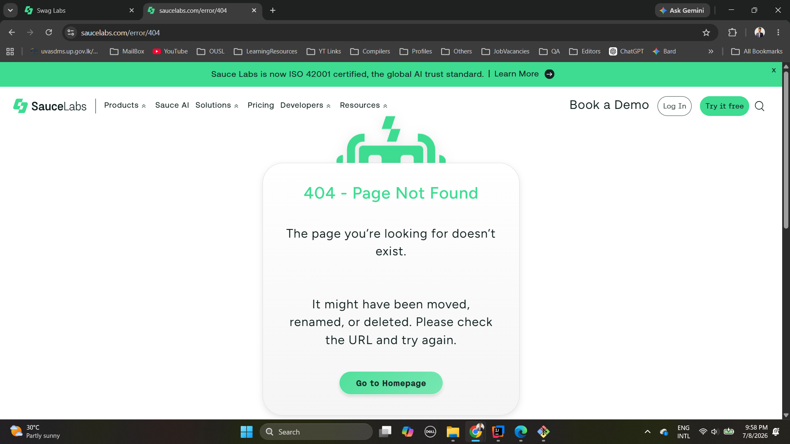

# SauceDemo Bug Report 

**Project:** SauceDemo Web Automation  
**Tester:** Sineth Shashintha  
**Environment:** Windows 11, Google Chrome, Selenium WebDriver, Java  
**Test User:** problem_user

---

## BugID 001: Incorrect product image is displayed on inventory(products) page for products

**Description:** When logsin to SauceDemo with problem user, incorrect
product images (one incorrect for all the products) are displayed for the products in the page.

**Severity:** High

**Steps to Reproduce:**
1. Open the SauceDemo login page.
2. Enter username as - problem_user(problem user profile).
3. Enter correct password - secret_sauce
4. Click Login
3. Observe the inventory/product listing images in the page.

**Expected Result:**
Each product should display the correct image that matches the product name.

**Actual Result:**
Product images appear incorrect or mismatched with the displayed product names. Same image is displayed for all the products in the page.

---

## BugID 002: Add to Cart / Remove button behaves inconsistently for some products

**Description:** When add the products in to the cart and remove products from the 
cart after login with problem user, time to time, add and remove actions are not working properly.

**Severity:** High

**Steps to Reproduce:**
1. Login to SauceDemo using problem_user.
2. On the inventory / products page, click **Add to cart** for different products.
3. Try to remove the same products after adding them.
4. Repeat the same steps for multiple products.

**Expected Result:**
All products should be added to the cart successfully, and the Remove button should work normally for every product.

**Actual Result:**
Some products cannot be added to the cart properly, and for some items the Remove button does not behave correctly.

---

## BugID 003: In Checkout page, last name field does not work correctly

**Description:** When user trying to enter lastname in input field, it's moving into firstname input field. Lastname field is not working properly.

**Severity:** High

**Steps to Reproduce:**
1. Login using problem_user.
2. Add at least one product to the cart.
3. Navigate to the cart page.
4. Click **Checkout**.
5. Enter a firstname, lastname, and postal code.
6. Observe lastname fields when entering lastname

**Expected Result:**
The user should be able to enter all checkout information and continue to the overview page entering the details properly.
The data should be entered to input fields properly.

**Actual Result:**
The Last Name field does not behave correctly, and the checkout process cannot proceed normally.

---

## BugID 004: Wrong / Incorrect product links in some products

**Description:** When clicks on some products system navigates to wrong product details.

**Severity:** High

**Steps to Reproduce:**
1. Login using problem_user.
2. Click on a product to see the product 
3. Do it multiple times and observe

**Expected Result:**
The user should be able to enter all checkout information and continue to the overview page entering the details properly.
The data should be entered to input fields properly.

**Actual Result:**
The Last Name field does not behave correctly, and the checkout process cannot proceed normally.

Eg: Click on Sauce Labs Backpack

---

## BugID 005: The cart badge or button state may not match the actual cart state.

**Description:** When add or remove some products, cart badge state is not displayed correctly accroding to the 
actual product count in the cart if user has logedin with problem user.

**Severity:** High

**Steps to Reproduce:**
1. Login using problem_user.
2. Add some products to cart
3. Remove products
4. Observe the cart badge

**Expected Result:**
Cart badge state should be updated correctly when adding and removing products.

**Actual Result:**
Sometimes, cart badge state is not updating according to the actual current product count of the cart.

---

## BugID 006: Filtering options is not working properly

**Description:** The sort dropdown or filter options is not responded as expected.
**Severity:** High

**Steps to Reproduce:**
1. Login using problem_user.
2. Change the product order by using filter option

**Expected Result:**
Cart badge state should be updated correctly when adding and removing products.

**Actual Result:**
Sometimes, cart badge state is not updating according to the actual current product count of the cart.

---

## BugID 07: When clicks on About link, it goes to a broken page

**Description:** The About menu item leads to a 404 page instead of a valid page.
**Severity:** High

**Steps to Reproduce:**
1. Login using problem_user.
2. Click on menu item
3. Click on About
4. Observe

**Expected Result:**
User should be navigated to About page.

**Actual Result:**
When clicks on about link, it navigates to a 404 broken page.

## Summary

The **problem_user** account exposes defects in inventory / product
display, cart interaction, and checkout process. 
These issues affect the normal shopping process / experience and 
should be reported as bugs.