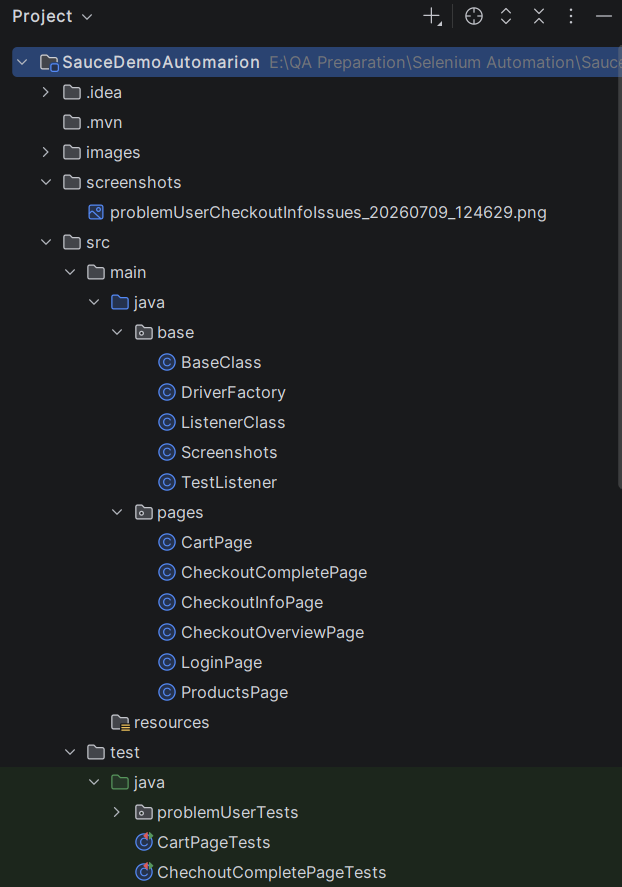
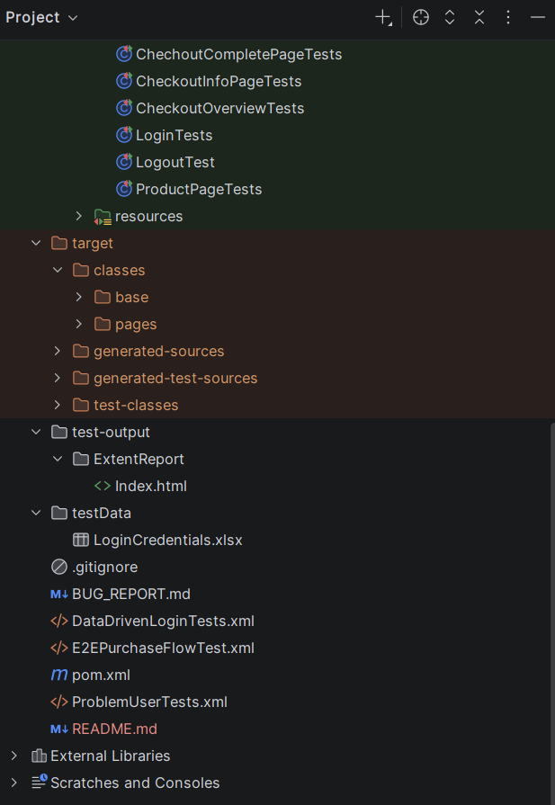

# SauceDemo Automation Framework

This project is a Selenium based automation framework for 
the SauceDemo application. It uses **Java 20**,
**Selenium**, **TestNG**, **Page Object Model (POM)**,
**Data Driven Testing**, **ExtentReports**, **Listeners**, 
and **Screenshots on failure** to provide maintainable and 
reliable test automation.

This framework includes:

- Data driven login testing with valid and invalid credentials from Excel.
- Happy path end to end tests.
- Problem user edge case tests to capture bugs.
- ExtentReports for detailed test execution results.
- Screenshot capture on test failure.
- Separate TestNG XML suites for different test flows.
- Bug report documentation in markdown format.

---

## Tech Stack

- Java 20
- Selenium WebDriver
- TestNG
- Apache POI
- ExtentReports
- Apache Commons IO
- WebDriverManager or local driver setup
- Maven

---

## Project Structure




---

## Features

### 1. Data Driven Login Testing
Login tests are executed using Excel test data with both valid and invalid credentials. This helps verify positive and negative login scenarios.

### 2. Page Object Model
Each page in the SauceDemo application has a separate page class, which keeps locators and actions organized and reusable.

### 3. ExtentReports
ExtentReports is used to generate detailed and readable test execution reports.

### 4. Listeners
Listeners are added to support reporting and screenshot capture during test execution.

### 5. Screenshots on Failure
When a test fails, the framework captures a screenshot automatically and stores it in the screenshots folder.

### 6. Happy Path and Edge Cases
The framework includes:
- standard user happy path tests.
- problem user bug/edge-case tests.

### 7. Bug Report
A separate bug report has been added to the project documenting 
the issues found with problem_user,

---

## Prerequisites

Make sure the following tools are installed on your machine:

- Java 20
- Maven
- IntelliJ IDEA or another Java IDE
- Google Chrome browser

---

## How to Install Dependencies

All required dependencies are already added in the pom.xml file. To install them:

1. Open the project in IntelliJ IDEA.
2. Open the terminal in the project root.
3. Run:

```bash
mvn clean install
```

This will download and install all Maven dependencies such as Selenium, TestNG, ExtentReports, Apache POI, and Commons IO.

---

## How to Run the Suite

This project contains three TestNG XML files:

- DataDrivenLoginTests.xml → for data driven login tests.
- E2EPurchaseFlowTest.xml → for standard end-to-end tests.
- ProblemUserTests → for problem user edge-case tests.

### Run from IDE
1. Open the project in IntelliJ IDEA.
2. Right click on the required testng.xml (Eg:E2EPurchaseFlowTest.xml) file.
3. Select **Run '...testng.xml'**.

### Run from Maven
You can run the suite from terminal using:

```bash
mvn clean test -DsuiteXmlFile=data-driven-tests.xml
```

For the happy path suite:

```bash
mvn clean test -DsuiteXmlFile=e2e-purchase-flow-test.xml
```

For the problem user suite:

```bash
mvn clean test -DsuiteXmlFile=problem-user-tests.xml
```

---

## Test Data

Test data for data-driven testing is stored in a separate folder under:

```text
testData/LoginCredentials.xlsx
```

This keeps test input data organized and makes it easier to maintain login scenarios.

---

## Test Reports

After test execution, the test results can be viewed in the `test-output/index.html` folder.  
ExtentReports output and screenshots will also be generated based on the framework configuration.

---

## Framework Design

This framework is built using:

- **Page Object Model** for maintainability.
- **Data Driven Testing** for login validation.
- **Listeners** for reporting and screenshots.
- **ExtentReports** for readable execution reports.
- **Separate suites** for normal flow and problem user edge cases.

This design keeps the framework modular, reusable, and easy to extend.

---

## Why This Framework Choice

I chose this framework because it supports both **functional validation** and **bug discovery** in a clean structure.  
The happy path suite verifies the standard user flow, while the problem user suite intentionally exposes edge case defects.  
Using POM, data driven testing, listeners, and reports makes the project easier to maintain and more useful for real QA work.

---

## Bug Report

The project includes a `BUG_REPORT.md` file containing the defects found during `problem_user` testing, along with relevant details and evidence.

---

## Notes

- Java 20 is used for this project.
- Screenshots are captured automatically on test failure.
- ExtentReports and TestNG listeners are already integrated.
- The framework is ready to run from IDE or Maven.

---